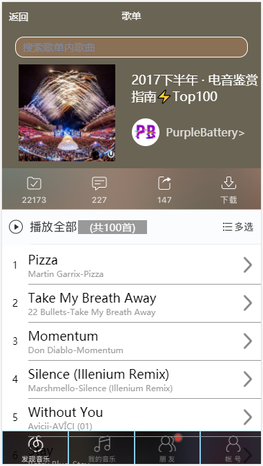
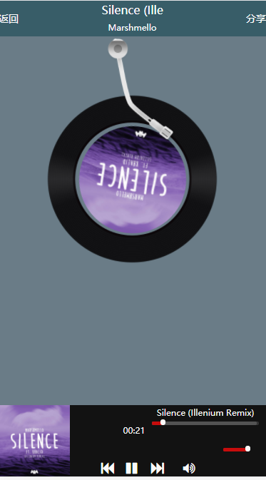

# vue仿网易云APP

## wangyiyun


这是一个以学习为目的的基于vue2 + vue-router2 + vuex + axios + mintUI + MUI +audeo插件的VUE实战项目，
做此项目主要是为了增强对VUE的理解和学习。做完之后发现诸多的BUG；
但是因为时间的关系，也没有去解决了，同时鉴于本人英语水平渣，
如果您看到我的代码变量请嘴下留情（尴尬脸）！
请自觉忽略样式不好看的问题哈哈哈，希望对初学VUE的朋友有所帮助！

## 线上地址
``` bash
http://1.xsnmusic.applinzi.com
```

##手机扫码访问
``` bash

```

##部分截图
``` bash




```
##项目地址

```shell
git clone https://github.com/xiaosineng/wangyiyun.git
```
## 安装

``` bash
# install dependencies
npm install

# serve with hot reload at localhost:8080
npm run dev

# pub for production with minification
npm run pub
```

## 目录结构

<pre>
.
├── publish.config     //项目打包配置         
├── util               // axios配置
├── config             // 项目不同环境的配置
├── dist               // 项目build目录
├── index.html         // 项目入口文件
├── package.json       // 项目配置文件
├── src
│   ├── assets         // css js 和图片资源
│   ├── components     // 各种组件
│   ├── lib            // audio 屏幕适配文件
│   ├── store	       // 状态管理store
│   ├── App.Vue        // 模板文件入口
│   └── main.js        // Webpack 预编译入口
│	
</pre>

## 感谢
感谢api提供者Binaryify；api地址为：https://github.com/Binaryify/NeteaseCloudMusicApi
感谢您的来访 ，如果对于您有帮助 ，就使劲的给个Star吧 ！ ^_^
